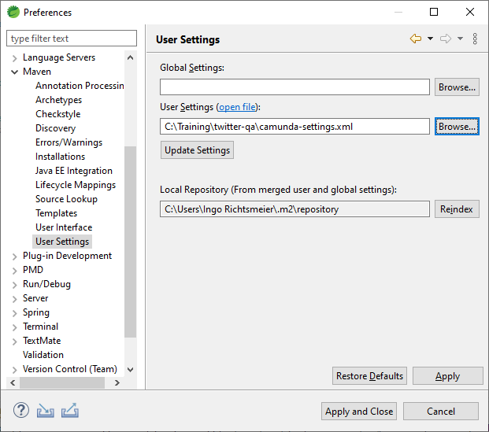
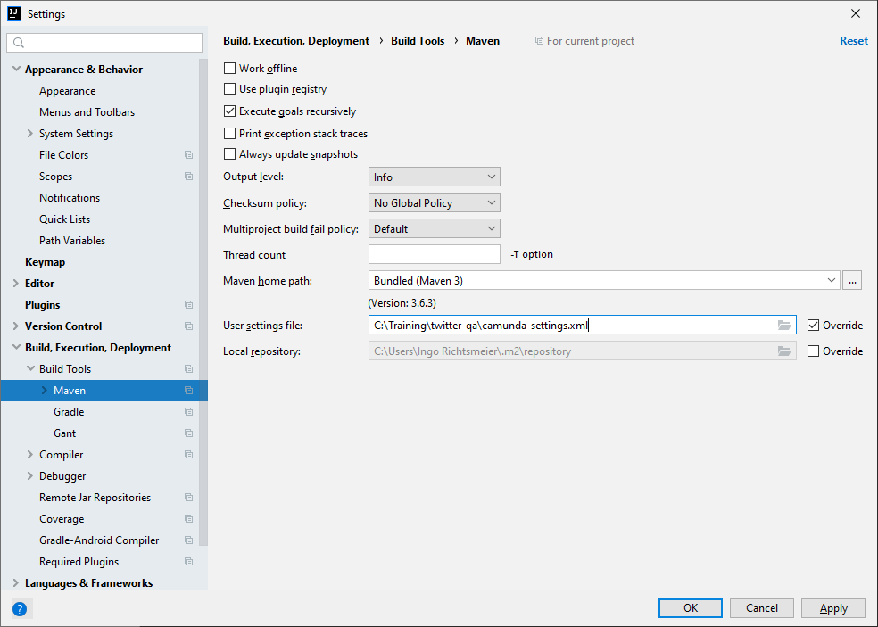

# twitter-qa
Template for the Camunda Training for Java Developers

## Maven Setup for Enterprise Version

This template is ready to be used in the Camunda Enterprise version. You need to configure your Maven to access the artefacts from the private repository https://camunda.jfrog.io/artifactory/private/.

### Company wide mirror available

If your company is already a enterprise customer and you have a maven mirror, you can use it. Maybe you already set this up. If your `settings.xml` located in the `.m2` directory in your home folder already contains  something like

```xml
  <mirrors>
    <mirror>
      <id>other-mirror</id>
      <name>Other Mirror Repository</name>
      <url>https://other-mirror.repo.other-company.com/maven2</url>
      <mirrorOf>central</mirrorOf>
    </mirror>
  </mirrors>
```

there is a good chance that you don't need any additional setup.

### Personal training setup

If you want to setup your personal environment only for this training, the most easy way is to configure a setting locally in your IDE workspace.

The [camunda-settings.xml](camunda-settings.xml) serves as a template. Open it in an editor.

If your computer uses a proxy to connect to the internet, add the proxy credentials in line 13 and 14. If not, delete the `proxies` section in lines 8 to 19.

In your license information you find a username and password to access the Camunda nexus server. 

You can apply for a 30-days trial license here: https://camunda.com/download/enterprise/. You will get an email with the license data.

Fill in the `username` and `password` in the server section for `camunda-bpm-nexus-ee` with the data from the email. 

#### Settings in Eclipse

In Eclipse, open the Preference page and select Maven -> User Settings. Browse to your `camunda-settings.xml` and click on "Update Settings".



#### Settings in IntelliJ

In IntelliJ, open the Settings dialog and select "Build, Execution, Deployment > Build Tools > Maven".

Check the box to "Override" and browse to your `camunda-settings.xml`.  

